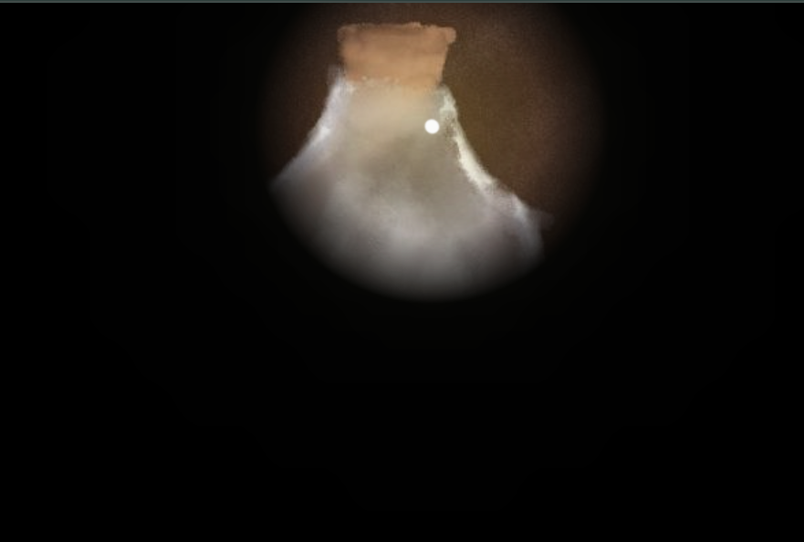
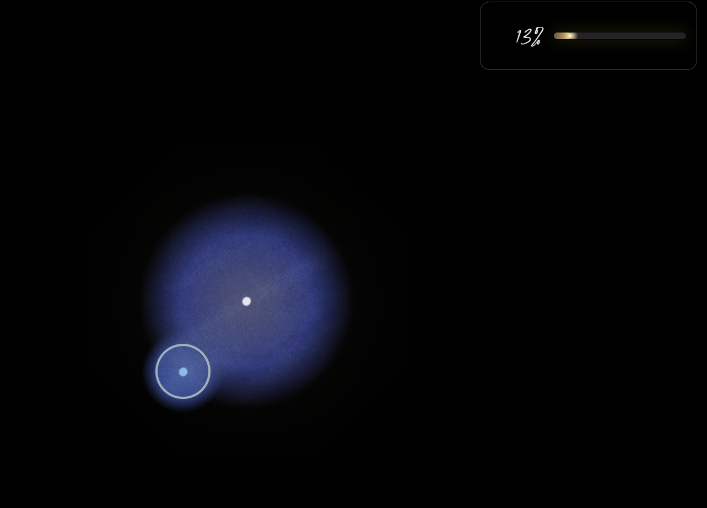
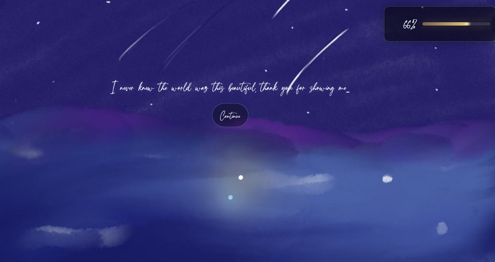

# Sparkles
A browser-based rhythm game built with vanilla JS, HTML, and CSS. No frameworks, no build step.

[▶ Play here](https://jenny6182.github.io/Sparkles/)






---
## What it is
You navigate a dark scene as a spark of light. Find the dimming spark hidden in the darkness, click near it to start the music, then click on beat to harmonize with it. Hit enough notes accurately before the song ends and the world lights up.


---
## Tech
- **Vanilla JS** — game loop, state machine, rhythm engine, beat detection
- **HTML5 Canvas** — darkness mask with radial gradient holes for lighting
- **Web Audio API** — low-latency audio playback and precise beat timing
- **CSS** — particle effects, glow animations, scene transitions


---
## Structure

```
index.html
game.js       — state machine, game loop, coordinator
orb.js        — Orb class (player + targets)
rhythm.js     — beat detection and scoring
audio.js      — Web Audio API wrapper
visuals.js    — canvas drawing, animations, scene management
levels.js     — level data (scenes, beat times, target positions)
style.css
scenes/       — level artwork
soundtrack/   — original music
```

---
All music and artwork are original (and may not be reused without permission)